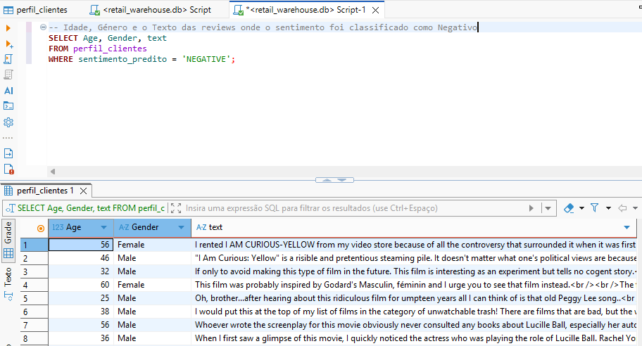
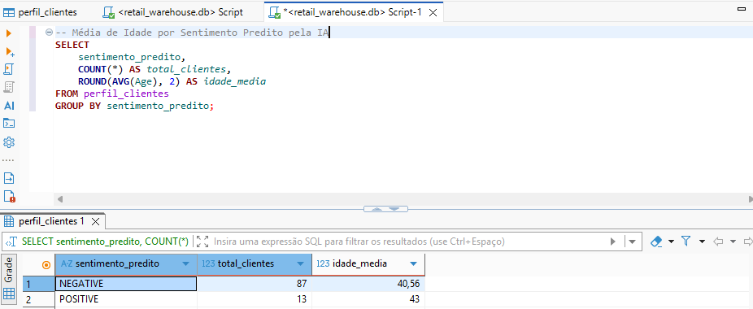
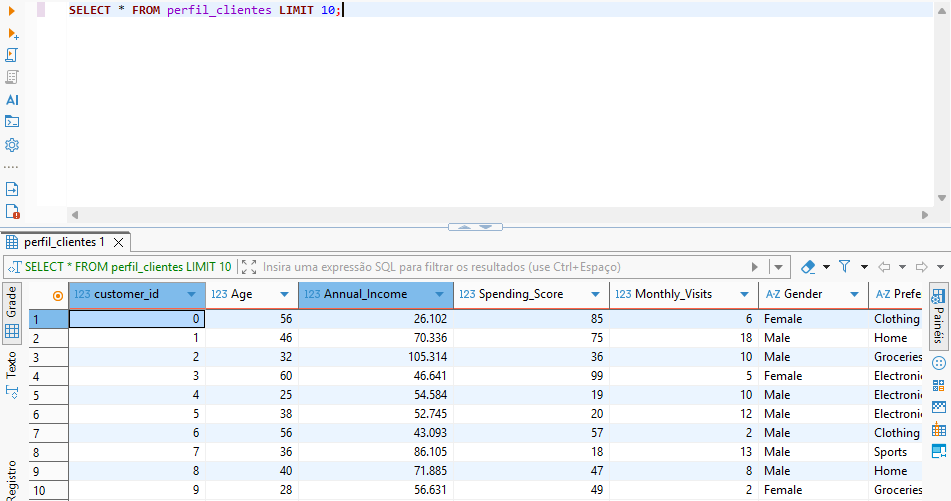

# Retail Sentiment Intelligence: Hybrid Data Pipeline
This project implements a Hybrid Data Architecture designed to transform raw retail data and customer reviews into strategic insights, utilising Artificial Intelligence (NLP) and relational storage.

This work was inspired by and grounded in the principles of Data Systems Engineering taught in the Master's in Artificial Intelligence, applying data integration methodologies and sentiment analysis for decision support.

# Technology Stack
- Language: Python
- AI/NLP: Hugging Face Transformers (distilbert-base-uncased)
- Databases: MongoDB (NoSQL) and SQLite (SQL)
- Data Management: DBeaver

# System Architecture
The pipeline is divided into three primary layers:
- Ingestion (Landing Zone): Collection of heterogeneous data, including customer profiles (CSV) and streaming of 10k IMDb reviews via the datasets library.
- Processing (Enrichment): Utilisation of a Deep Learning model for sentiment analysis. The script processes the text, classifies polarity (Positive/Negative), and integrates the data via a unique customer_id.
- Data Warehouse (Storage): Processed data is injected into a SQL database (retail_warehouse.db), enabling structured querying.

# Business Insights
Through this architecture, it is possible to answer critical business questions such as:
- What is the average age of customers with negative sentiments?
- Is there a correlation between customer gender and product satisfaction?

### Results in DBeaver

